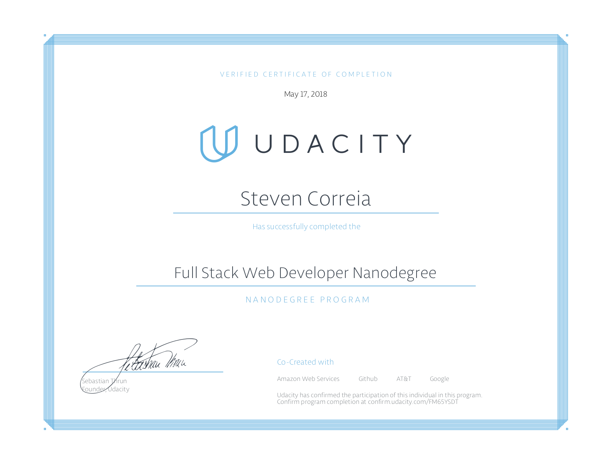

# Udacity Full Stack Web Developer Nanodegree

The Full Stack Web Developer Nanodegree program from Udacity is designed to teach developers the fundamentals of web applications.

The core cirriculum consists of 5 parts, each focusing on a new element of web development while building upon the previous lessons.

## Part One: Progamming Fundamentals and the Web

This section focuses on object-oriented Python programming, HTML, CSS, and responsive Web design.

- [Movie Trailer Website](https://github.com/sjcorreia/ud036_StarterCode)
- [Portfolio Site](https://github.com/sjcorreia/fullstack_proj2)

## Part Two: Developers' Tools

Part two contains serveral lectures about essential developers' tools such as the Unix shell, Git, and Github; then applying new skills to investigate HTTP, the Web's fundamental protocol.

## Part Three: The Backend: Databases & Applications

Part Three focuses on mastering SQL databases and building multi-user web applications using the Flask framework, SQLAlchemy, and authentication providers such as Google and Facebook.

- [Logs Analysis Project](https://github.com/sjcorreia/log-analysis)
- [Item Catalog Application](https://github.com/sjcorreia/catalog-project)

## Part Four: The Frontend: Javascript & AJAX

Part Four shows how JavaScript, JQuery, and AJAX are used in the web frontend to build advanced interactive web applications.

- [Neighborhood Map](https://github.com/sjcorreia/neighborhood-map)

## Part Five: Deploying to Linux Servers

Most web application run on Linux servers. Part Five teaches the essentials of securing and configuring Linux web servers, then deploying a full-stack application to a live server with a database and routing.

- [Linux Server Configuration](https://github.com/sjcorreia/server-configuration)
